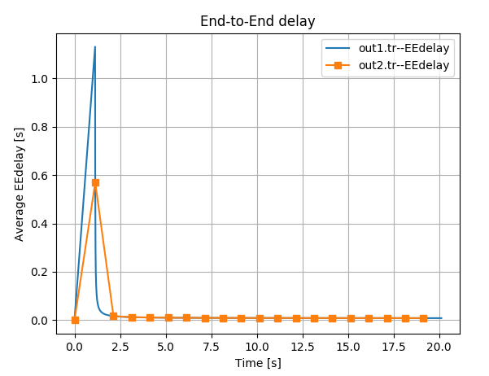
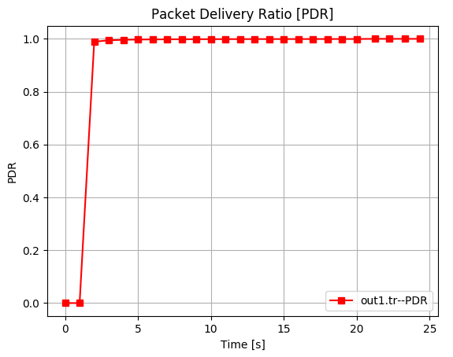
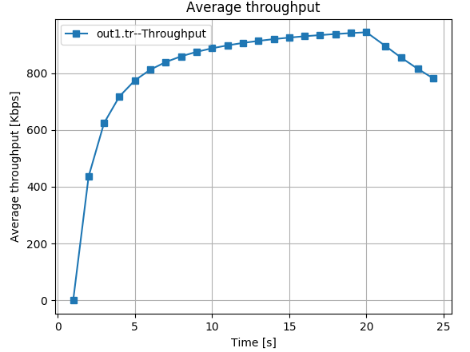
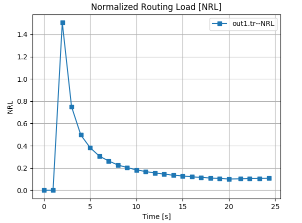

# traceanalyzer
This library  provides analyzing and plotting functions for ns2 trace file in Python. Bellow, example of   ns2 trace file content.

#### Example: content of ns2 trace file
```
+ 4.451157 6 10 tcp 1540 ------- 0 32.0 33.0 197 2293
- 4.451157 6 10 tcp 1540 ------- 0 32.0 33.0 197 2293
r 4.45128 2 6 tcp 1540 ------- 0 32.0 33.0 198 2294
+ 4.45128 6 10 tcp 1540 ------- 0 32.0 33.0 198 2294
- 4.45128 6 10 tcp 1540 ------- 0 32.0 33.0 198 2294
r 4.451289 20 19 rtProtoDV 34 ------- 0 20.1 19.1 -1 2308
r 4.451289 20 21 rtProtoDV 34 ------- 0 20.1 21.1 -1 2309
r 4.451289 20 24 rtProtoDV 34 ------- 0 20.1 24.1 -1 2310
r 4.451403 2 6 tcp 1540 ------- 0 32.0 33.0 199 2295
+ 4.451403 6 10 tcp 1540 ------- 0 32.0 33.0 199 2295
- 4.451403 6 10 tcp 1540 ------- 0 32.0 33.0 199 2295
r 4.451526 2 6 tcp 1540 ------- 0 32.0 33.0 200 2296
r 4.531403 23 33 tcp 1540 ------- 0 32.0 33.0 191 2287
+ 4.531403 33 23 ack 40 ------- 0 33.0 32.0 191 2313
- 4.531403 33 23 ack 40 ------- 0 33.0 32.0 191 2313
r 4.531526 23 33 tcp 1540 ------- 0 32.0 33.0 192 2288
+ 4.531526 33 23 ack 40 ------- 0 33.0 32.0 192 2314
- 4.531526 33 23 ack 40 ------- 0 33.0 32.0 192 2314
r 4.53165 23 33 tcp 1540 ------- 0 32.0 33.0 193 2289
+ 4.53165 33 23 ack 40 ------- 0 33.0 32.0 193 2315
- 4.53165 33 23 ack 40 ------- 0 33.0 32.0 193 2315
```
## Structure
`traceanalyzer` provide four main classes : `Eedelay`, `Pdr`, `Throughput` and `Nrl`.<br>
According to [`RFC` (Request for comments)](https://rfc-editor.org) those main classes compute the average of end-to-end delay, the Packet Delivery Ratio, the Throughput and the Normalized Routing Load from `ns2 trace file`. Those provide also plotting and data array extracted from ns2 trace file.


### `Eedelay` class
For managing (computing, sampling and plotting) the average of end-to-end delay of simulation from trace file.<br>
`end-to-end delay=Time/No.Sample`
#### arguments
-1st: trace file<br>
-2nd: node
#### outputs
##### data array
Data without sampling.<br>
`eedelay_array` <br>
`time_array` <br>
Data with sampling.<br>
`eedelay_sample` <br>
`time_sample` <br>
##### constant
value      
### `Pdr` class
For managing (computing, sampling and plotting) the Packet Delivery Ratio (`PDR`) of simulation from trace file.<br>
`PDR=No.delivered Packet/No.Sent Packet`
#### arguments
-1st: trace file<br>
-2nd: node
#### outputs
##### data array
Data without sampling.<br>
`pdr_array` <br>
`time_array` <br>
Data with sampling.<br>
`pdr_sample` <br>
`time_sample` <br>
##### constant
value  
        
### `Throughput` class
For managing (computing, sampling and plotting) the Throughput average of simulation from trace file.<br>
`Average Throughput=Packet received/Time Taken`
####  arguments
-1st: trace file<br>
-2nd: node
#### outputs
##### data array
Data without sampling.<br>
`throughput_array` <br>
`time_array` <br>
Data with sampling.<br>
`throughput_sample` <br>
`time_sample` <br>
##### constant
value 
### `Nrl` class
For managing (computing, sampling and plotting) the Normalized Routing Load (`NRL`) of simulation from trace file.<br>
`NRL=No.Routed packet/No.Delivery packet`
#### arguments
-1st: trace file<br>
-2nd: routing packet type
#### outputs
#####  data array
Data without sampling.<br>
`nrl_array` <br>
`time_array` <br>
Data with sampling.<br>
`nrl_sample` <br>
`time_sample` <br>
##### constant
value 
### `Common` methods
#### sample()
For sampling data, by default sampling step is 1 sec.
#### plot()
for plotting data, the arguments are the same than matplotlib.
## Installation

Use the package manager [pip](https://pip.pypa.io/en/stable/) to install traceanalyzer.

```bash
pip3 install traceanalyzer

```

## Usage
###Eedelay: End-to-End delay
####code
```python
import  traceanalyzer as tr
#end-to-end delay
eedelay1=tr.Eedelay('out1.tr','33')
eedelay2=tr.Eedelay('out2.tr','33')
eedelay2.sample()#eedelay2.sample(1.5) for sampling with step=1.5
eedelay1.plot()
eedelay2.plot()
#getting data
time=eedelay2.time_sample
eedelay=eedelay2.eedelay_sample
idx=0
for instant in time:
    print(instant,' ',eedelay[idx]) 
    idx+=1
```
####output


```
0   0
1.13904   0.56952
2.13904   0.016842834645669293
3.13904   0.012456507936507938
4.14704   0.01097100529100529
5.14704   0.010232683896620277
6.14704   0.009788280254777069
7.14704   0.009491420982735723
8.14704   0.009279088838268792
9.14704   0.009119680957128614
10.14704   0.008995602836879434
11.14704   0.008896280925778132
12.14704   0.008814978229317852
13.14704   0.008747198935462408
14.14704   0.00868982800982801
15.14704   0.008640638904734741
16.14704   0.008597997870074548
17.14704   0.008560678981527708
18.14704   0.008527744360902256
19.14704   0.008498464269862406
```
###Pdr: Packet Delivery Ratio
####code
```python
import traceanalyzer as tr
#Packet Delivery Ratio
pdr1=tr.Pdr('out1.tr','33')
pdr1.sample()
pdr1.plot('sr-') #plotting with argument
#getting data
time=pdr1.time_sample
pdr=pdr1.pdr_sample
idx=0
for instant in time:
    print(instant,' ',pdr[idx]) 
    idx+=1
```
####output


```
0   0
1.0   0
2.0   0.9889106327462491
3.0   0.9946168461051298
4.0   0.9964457453481079
5.0   0.9973470661672909
6.0   0.9978837296153368
7.0   0.9982398012010768
8.0   0.9984933085172383
9.0   0.998682987294701
10.0   0.9988302484001926
11.0   0.9989478895902958
12.0   0.9990440308159478
13.0   0.9991240725474031
14.0   0.999191746303428
15.0   0.9992497131256068
16.0   0.9992999217559609
17.0   0.9993438320209974
18.0   0.9993825591108851
19.0   0.9994169696138281
20.0   0.9994477471331579
21.235556   1.0
22.238848   1.0
23.322692   1.0
24.352604   1.0
```
###Throughput
####code
```python
import  traceanalyzer as tr
#Throughput
throughput1=tr.Throughput('out1.tr','33')
throughput1.sample()#eedelay2.sample(1.5) for sampling with step=1.5
throughput1.plot()
#getting data
time=throughput1.time_sample
throughput=throughput1.throughput_sample
idx=0
for instant in time:
    print(instant,' ',throughput[idx]) 
    idx+=1
```
####output


```
1.0   0.0
2.0   436.0
3.0   624.0
4.0   718.0
5.0   774.4
6.0   812.0
7.0   838.8571428571429
8.0   859.0
9.0   874.6666666666666
10.0   887.2
11.0   897.4545454545454
12.0   906.0
13.0   913.2307692307693
14.0   919.4285714285714
15.0   924.8
16.0   929.5
17.0   933.6470588235294
18.0   937.3333333333334
19.0   940.6315789473684
20.0   943.6
21.235556   895.1025346357779
22.238848   854.7205322865644
23.322692   815.0002581177164
24.352604   780.5325459240416
```
###Nrl: Normalized Routing Load
####code
```python
import  traceanalyzer as tr
#Normalized Routing Load
nrl1=tr.Nrl('out1.tr','rtProtoDV')
nrl1.sample()
nrl1.plot()
#getting data
time=nrl1.time_sample
nrl=nrl1.nrl_sample
idx=0
for instant in time:
    print(instant,' ',nrl[idx]) 
    idx+=1
```
####output


```
0   0
1.0   0
2.0   1.5052770448548813
3.0   0.7503979624323464
4.0   0.49685270667226183
5.0   0.38319511813487717
6.0   0.3070109780439122
7.0   0.2635618711751893
8.0   0.2274099059115924
9.0   0.20425102784888682
10.0   0.1831771837971893
11.0   0.1688247320488198
12.0   0.15484633569739953
13.0   0.14527358052704864
14.0   0.13513513513513514
15.0   0.12839538889625016
16.0   0.12107475480095607
17.0   0.11583175620872117
18.0   0.11004506468963512
19.0   0.10613911670841769
20.0   0.10147565494376909
21.235556   0.10311447811447812
22.238848   0.10495985495985496
23.322692   0.1060929810929811
24.352604   0.10816498316498316
```

## Contributing
Pull requests are welcome. For major changes, please open an issue first to discuss what you would like to change.

Please make sure to update tests as appropriate.

## License
[MIT](https://choosealicense.com/licenses/mit/)
